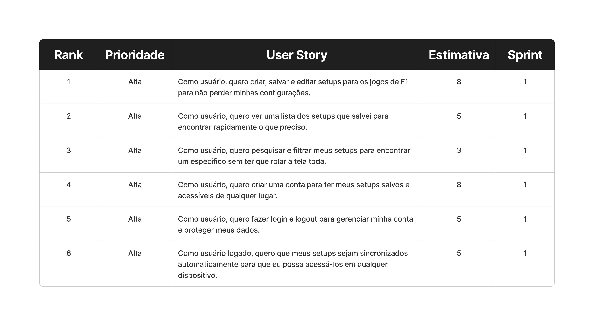
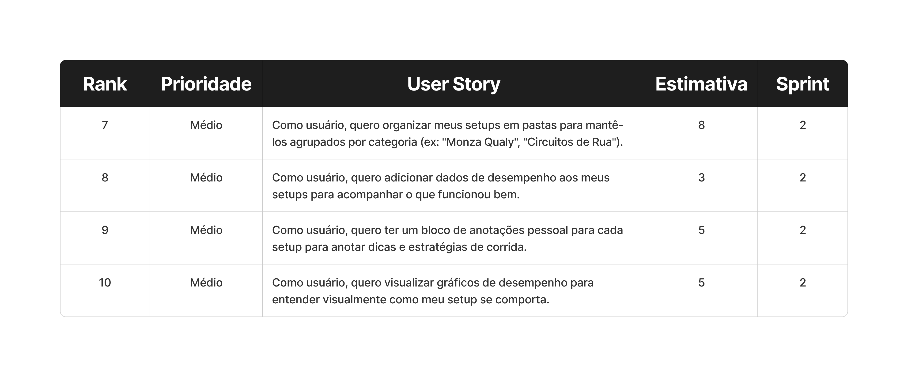
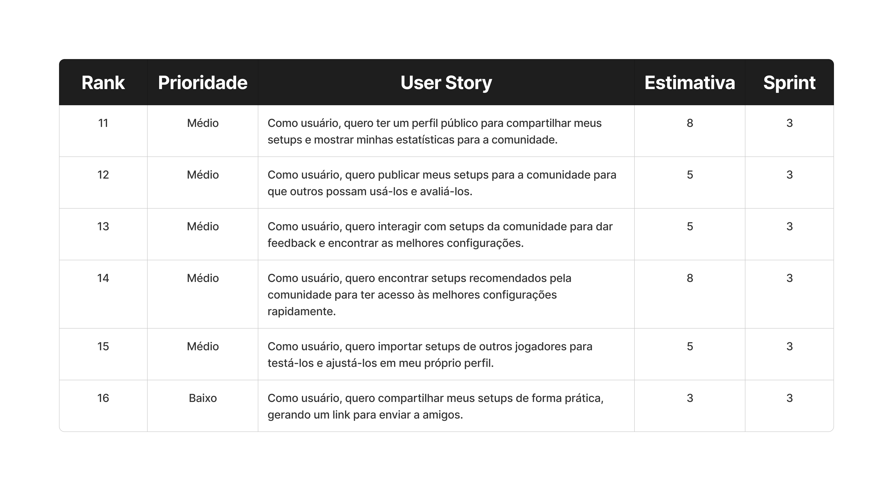

# 🏎️ Apex F1 Assistant

<div align="center">


**O seu engenheiro de corrida de bolso. Gerencie setups, planeje estratégias e conecte-se com a comunidade de F1 24.**

[📱 Funcionalidades](#-funcionalidades) • [🛠️ Stack](#%EF%B8%8F-stack-tecnológica) • [🚀 Instalação](#-instalação) • [📋 Backlog](#-backlog-e-critérios)

</div>

---

## 📄 Sobre o Projeto

O **Apex F1 Assistant** é uma plataforma completa para pilotos virtuais de Fórmula 1. Muito mais do que um bloco de notas, ele é um hub de engenharia que permite criar, organizar e compartilhar ajustes mecânicos de precisão.

Com suporte offline-first e sincronização em nuvem, o Apex garante que sua estratégia esteja sempre à mão, seja no meio de uma sessão classificatória ou discutindo ajustes com amigos.

---

## ✨ Funcionalidades

### 🛠️ Engenharia de Setup
- **Criação Detalhada:** Ajuste fino de Aerodinâmica, Transmissão, Geometria, Suspensão, Freios e Pneus.
- **Validação em Tempo Real:** Regras automáticas que garantem que seu setup esteja dentro dos limites do jogo F1 24.
- **Organização por Pastas:** Agrupe seus ajustes por campeonato, clima ou estilo de pilotagem.

### 📊 Estratégia de Corrida
- **Calculadora de Combustível:** Estime a carga ideal para a largada.
- **Gestão de Pneus:** Controle seu inventário de compostos disponíveis.
- **Múltiplos Cenários:** Crie planos A, B e C com diferentes janelas de parada (Pit Windows).

### 🌎 Comunidade e Social
- **Feed de Setups:** Descubra os ajustes mais rápidos compartilhados por outros pilotos.
- **Sistema de Avaliação:** Teste setups da comunidade e deixe sua nota (estrelas).
- **Clonagem Inteligente:** Importe qualquer setup público para sua biblioteca pessoal com um clique.
- **Perfis Sociais:** Siga seus criadores favoritos e veja suas estatísticas de contribuição.
- **Compartilhamento Externo:** Gere links profundos (Deep Links) para enviar seus setups via WhatsApp ou Discord.

### 🔒 Segurança e Performance
- **Offline-First:** O app funciona perfeitamente sem internet e sincroniza quando reconectado.
- **Autenticação Híbrida:** Login via E-mail/Senha ou Google.
- **Dark Mode Nativo:** Interface otimizada para baixo consumo de bateria e conforto visual.

---

## 📋 Backlog e Critérios

Abaixo estão as User Stories que guiaram o desenvolvimento do MVP até a versão 1.0.

### 📌 Sprint 1: Fundação e CRUD
> **Foco:** Garantir que o usuário possa salvar e recuperar seus dados com segurança.



* **US 01 (Setup):** Criar formulário completo com validação para todos os parâmetros do carro.
* **US 02 (Listagem):** Exibir lista de setups salvos com resumo visual.
* **US 03 (Filtros):** Filtrar lista por Pista, Carro e Condições.
* **US 04/05 (Auth):** Cadastro e Login seguro com persistência de sessão.
* **US 06 (Sync):** Sincronização automática entre dispositivos via Nuvem.

### 📌 Sprint 2: Organização e Estratégia
> **Foco:** Transformar dados soltos em informação útil para a corrida.



* **US 07 (Pastas):** Criar sistema de pastas para categorizar setups.
* **US 08/09 (Notas):** Adicionar campo de anotações técnicas e dicas de pilotagem.
* **US 10 (Estratégia):** Criar módulo de planejamento de paradas e combustível.

### 📌 Sprint 3: Comunidade e Social
> **Foco:** Conectar os pilotos e permitir a troca de conhecimento.



* **US 11 (Perfil):** Página de perfil com foto, gamertags e estatísticas.
* **US 12 (Publicação):** "Switch" de privacidade para tornar setups públicos.
* **US 13 (Avaliação):** Sistema de Rating (1-5 estrelas) com proteção contra fraude.
* **US 14 (Discovery):** Seção "Em Alta" na Home com os melhores setups.
* **US 15 (Importação):** Funcionalidade de "Clonar" setups de terceiros.
* **US 16 (Share):** Deep Linking para abrir o app direto no setup compartilhado.

---

## 🛠️ Stack Tecnológica

<div align="center">

| Categoria | Tecnologia |
|-----------|------------|
| **Framework** | React Native (Expo) |
| **Linguagem** | TypeScript |
| **UI & Estilo** | Gluestack UI + NativeWind (Tailwind) |
| **Backend** | Firebase (Auth, Firestore, Storage) |
| **Gerenciamento de Estado** | Zustand |
| **Navegação** | Expo Router (File-based routing) |
| **Build & Deploy** | EAS (Expo Application Services) |

</div>

---

## 🚀 Instalação e Execução

### Pré-requisitos
- Node.js (v18+)
- Expo CLI (`npm install -g eas-cli`)
- Um dispositivo Android/iOS ou Emulador configurado.

## Passo a Passo

1. **Clone o repositório**
   ```bash
   git clone https://github.com/Duponesss/FormulaSetupManager.git
   cd FormulaSetupManager
   ```

2. **Instale as dependências**
   ```bash
   npm install
   ```

3. **Configure as Variáveis de Ambiente**
   Crie um arquivo `.env` na raiz e adicione suas chaves do Firebase (disponíveis no console do projeto):
   ```env
   EXPO_PUBLIC_API_KEY=sua_api_key
   EXPO_PUBLIC_AUTH_DOMAIN=seu_projeto.firebaseapp.com
   EXPO_PUBLIC_PROJECT_ID=seu_project_id
   # ... outras variáveis do firebase
   ```

4. **Execute o projeto**
   ```bash
   npx expo start
   ```

## 📱 Estrutura de Pastas (Expo Router)

A arquitetura segue o padrão de rotas baseadas em arquivos do Expo Router v3:

```
app/
├── (auth)/              # Rotas de Autenticação (Login, Registro)
├── (tabs)/              # Rotas da Barra de Navegação Inferior
│   ├── index.tsx        # Home (Hub Principal)
│   ├── profile-screen   # Perfil do Usuário
│   ├── folders-screen   # Gerenciador de Pastas
│   └── ...
├── setup/
│   └── [id].tsx         # Rota Dinâmica para Deep Linking
├── _layout.tsx          # Configuração Global (Providers, Theme)
└── ...
src/
├── components/          # Componentes Reutilizáveis (Cards, Modais)
├── stores/              # Lógica de Estado (Zustand)
├── services/            # Configuração do Firebase
└── hooks/               # Hooks Customizados (useAuth, useSingleTap)
```

## 👨‍💻 Autor

**Desenvolvido com ❤️ por Duponesss**

[](https://github.com/JoaoGabrielGarcia)
[](https://www.linkedin.com/in/jo%C3%A3o-gabriel-oliveira-garcia/)

---

<div align="center">

**⭐ Se este projeto te ajudou a ganhar alguns décimos na pista, deixe uma estrela!**

</div>