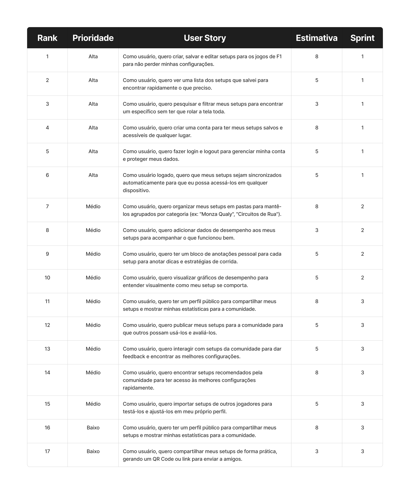

# 🏎️ Apex F1 Assistant

<div align="center">


**Um aplicativo mobile para gerenciar setups de carros de Fórmula 1 em jogos de corrida**

[📱 Demo](#-demo) • [🚀 Instalação](#-instalação) • [📖 Documentação](#-documentação)

</div>

---

## 📄 Sobre o Projeto

O **Apex F1 Assistant** é um aplicativo mobile desenvolvido para entusiastas de jogos de corrida de Fórmula 1. Ele permite que os usuários salvem, gerenciem e consultem seus setups de carro (configurações) para diferentes circuitos e condições climáticas, otimizando a performance nas pistas virtuais.

Este projeto foi criado para centralizar as informações dos setups, oferecendo uma solução moderna e intuitiva.

## 📄 Backlog do Produto


## Sprint 1


### User Stories da 1 Sprint
- **US 01:** Como usuário, quero criar, salvar e editar setups para os jogos de F1 para não perder minhas configurações.

- **US 02:** Como usuário, quero ver uma lista dos setups que salvei para encontrar rapidamente o que preciso.

- **US 03:** Como usuário, quero pesquisar e filtrar meus setups para encontrar um específico sem ter que rolar a tela toda.

- **US 04:** Como usuário, quero criar uma conta para ter meus setups salvos e acessíveis de qualquer lugar.

- **US 05:** Como usuário, quero fazer login e logout para gerenciar minha conta e proteger meus dados.

- **US 06:** Como usuário logado, quero que meus setups sejam sincronizados automaticamente para que eu possa acessá-los em qualquer dispositivo.

## ✨ Funcionalidades Principais

- **👤 Autenticação Segura**: Sistema completo de login e cadastro com Firebase Auth
- **📝 Gerenciamento de Setups**: CRUD completo para criar, visualizar, editar e deletar setups
- **🔍 Busca Inteligente**: Encontre setups específicos com filtros avançados
- **⚙️ Configurações Detalhadas**: Aerodinâmica, Transmissão, Geometria da Suspensão, Suspensão, Freios e Pneus
- **📱 Design Responsivo**: Interface moderna construída com Gluestack UI

## 🛠️ Stack Tecnológica

<div align="center">

| Categoria | Tecnologia |
|-----------|------------|
| **Framework** | React Native |
| **UI Library** | Gluestack UI |
| **Estilização** | Tailwind CSS + NativeWind |
| **Backend** | Firebase (Auth + Firestore) |
| **Gerenciamento de Estado** | Zustand |
| **Navegação** | Expo Router |

</div>

## 🚀 Instalação

### Pré-requisitos

- **Node.js** (versão 18 ou superior)
- **npm** ou **yarn**
- **Expo CLI** instalado globalmente
- **Android Studio** (para Android) ou **Xcode** (para iOS)

### Configuração do Ambiente

```bash
# Instalar Expo CLI globalmente
npm install -g @expo/cli

# Verificar instalação
expo --version
```

### Clonando e Configurando o Projeto

```bash
# 1. Clone o repositório
git clone https://github.com/Duponesss/FormulaSetupManager.git

# 2. Acesse o diretório do projeto
cd FormulaSetupManager

# 3. Instale as dependências
npm install

# 4. Configure as variáveis de ambiente
cp .env.example .env
```

### Configuração do Firebase

1. **Acesse o [Console do Firebase](https://console.firebase.google.com/)**
2. **Crie um novo projeto** ou use um existente
3. **Configure a autenticação**:
   - Ative Email/Password
   - Ative Google Sign-In (opcional)
4. **Configure o Firestore Database**
5. **Baixe os arquivos de configuração**:
   - `google-services.json` (Android)
   - `GoogleService-Info.plist` (iOS)

### Executando o Projeto

```bash
# Iniciar o servidor de desenvolvimento
npx expo start

# Para executar no Android
npx expo run:android

# Para executar no iOS (apenas macOS)
npx expo run:ios

# Para executar na web
npx expo start --web
```

<!-- ## 📂 Estrutura do Projeto

```bash
FormulaSetupManager/
├── 📁 app/                          # Expo Router - Estrutura de rotas
│   ├── 📁 (auth)/                   # Grupo de rotas de autenticação
│   │   ├── _layout.tsx              # Layout das telas de auth
│   │   └── index.tsx                # Tela de login
│   ├── 📁 (tabs)/                   # Grupo de rotas principais
│   │   ├── _layout.tsx              # Layout com navegação em tabs
│   │   ├── index.tsx                # Tela inicial (Home)
│   │   ├── create-setup.tsx         # Criar novo setup
│   │   ├── setup-details.tsx        # Detalhes do setup
│   │   ├── aerodynamics.tsx         # Configurações aerodinâmicas
│   │   ├── suspension.tsx           # Configurações de suspensão
│   │   └── tires-brakes.tsx         # Configurações de pneus e freios
│   └── _layout.tsx                  # Layout raiz da aplicação
├── 📁 components/                   # Componentes de UI reutilizáveis
│   └── 📁 ui/                       # Componentes Gluestack UI
├── 📁 src/                          # Código fonte principal
│   ├── 📁 contexts/                 # Context providers
│   │   ├── AuthContext.tsx          # Contexto de autenticação
│   │   └── ThemeContext.tsx         # Contexto de tema
│   ├── 📁 hooks/                    # Custom hooks
│   │   └── use-auth.ts              # Hook de autenticação
│   ├── 📁 screens/                  # Componentes de tela
│   │   ├── AuthScreen.tsx           # Tela de autenticação
│   │   ├── HomeScreen.tsx           # Tela inicial
│   │   ├── CreateSetupScreen.tsx    # Tela de criação de setup
│   │   ├── SetupDetailsScreen.tsx   # Tela de detalhes
│   │   ├── AerodynamicsScreen.tsx   # Tela de aerodinâmica
│   │   ├── SuspensionScreen.tsx     # Tela de suspensão
│   │   └── TiresBrakesScreen.tsx    # Tela de pneus e freios
│   └── 📁 services/                 # Serviços externos
│       └── firebaseConfig.ts        # Configuração do Firebase
├── 📄 package.json                  # Dependências e scripts
├── 📄 tailwind.config.js            # Configuração do Tailwind
├── 📄 tsconfig.json                 # Configuração do TypeScript
├── 📄 app.json                      # Configuração do Expo
├── 📄 global.css                    # Estilos globais
└── 📄 README.md                     # Este arquivo
``` -->

## 🎯 Funcionalidades Implementadas

### ✅ Autenticação
- [x] Login com email/senha
- [x] Cadastro de novos usuários
- [x] Logout
- [🚧] Persistência de sessão

### ✅ Gerenciamento de Setups
- [x] Criar novos setups
- [x] Listar setups salvos
- [x] Visualizar detalhes do setup
- [x] Editar configurações existentes
- [x] Deletar setups

### ✅ Configurações de Carro
- [x] **Aerodinâmica**: Asa dianteira e traseira
- [x] **Suspensão**: Altura, rigidez, amortecimento
- [x] **Pneus e Freios**: Pressão, temperatura, força de frenagem
- 🚧 **As configurações detalhadas ainda estão em desenvolvimento**

### ✅ Interface e UX
- [🚧] Modo escuro/claro

## 🔮 Roadmap

### 📋 Próximas Funcionalidades
- [🚧] **Importação/Exportação** de setups
- [🚧] **Compartilhamento** de setups entre usuários
- [🚧] **Categorização** por jogo (F1 23, F1 24, etc.)
- [🚧] **Filtros avançados** por circuito e condições
- [🚧] **Backup automático** na nuvem
- [🚧] **Modo offline** com sincronização

### 🎮 Integração com Dados dos Jogos
- [🚧] Suporte para **F1 23 e versões anteriores**
- [🚧] Suporte para **F1 25**

### 📋 Guidelines

- Siga os padrões de código existentes
- Adicione testes para novas funcionalidades
- Atualize a documentação quando necessário
- Use commits semânticos

## 📱 Demo

> **Em breve**: Screenshots e vídeos demonstrativos da aplicação

## 👨‍💻 Autor

**Desenvolvido com ❤️ por Duponesss**

[](https://github.com/JoaoGabrielGarcia)
[](https://www.linkedin.com/in/jo%C3%A3o-gabriel-oliveira-garcia/)

---

<div align="center">

**⭐ Se você gostou deste projeto, considere dar uma estrela!**

</div>